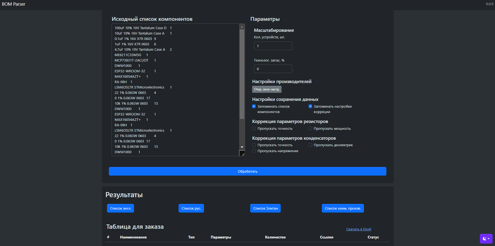
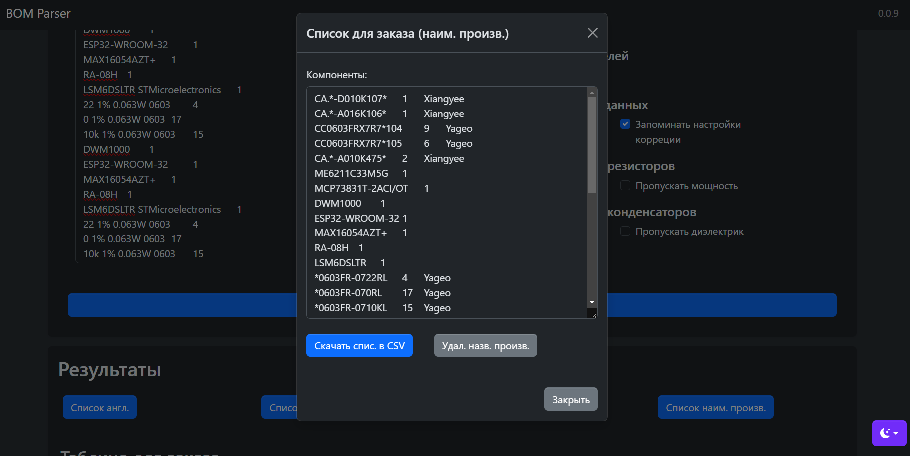
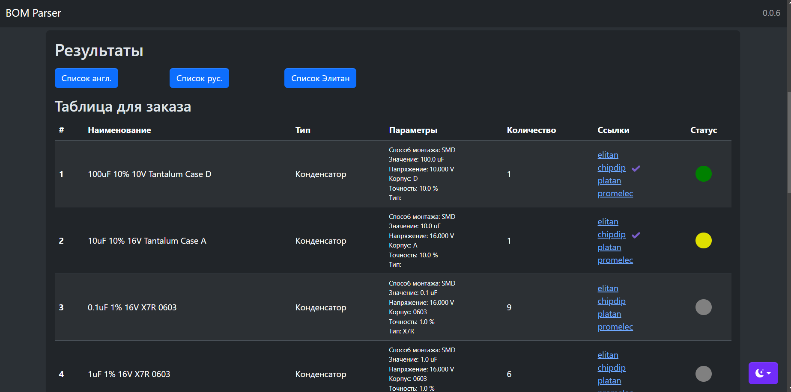

# PCB_BOM_Parser_Py
Парсер BOM листа для печатной платы для ускорения заказа компонентов

## Внешний вид




## Входные данные
В качестве входных данных приложения используются строки с названиями (либо с набором параметров как на русском, так и на английском языке) компонентов и их количеством (с разделением точкой с запятой, либо табуляцией).

### Пример с разделением табуляцией

Данные в таком формате можно ввести скопировав из таблицы Excel
```
100uF 10% 10V Tantalum Case D 	1
10uF 10% 16V Tantalum Case A 	1
0.1uF 1% 16V X7R 0603 	9
1uF 1% 16V X7R 0603 	6
4.7uF 10% 10V Tantalum Case A 	2
ME6211C33M5G 	1
MCP73831T-2ACI/OT 	1
DWM1000 	1
ESP32-WROOM-32 	1
MAX16054AZT+ 	1
RA-08H 	1
LSM6DSLTR STMicroelectronics 	1
22 1% 0.063W 0603 	4
0 1% 0.063W 0603 	17
10k 1% 0.063W 0603 	15
```

### Пример с разделением точкой с запятой
```
100uF 10% 10V Tantalum Case D;1
10uF 10% 16V Tantalum Case A;1
0.1uF 1% 16V X7R 0603;9
1uF 1% 16V X7R 0603;6
4.7uF 10% 10V Tantalum Case A;2
ME6211C33M5G;1
MCP73831T-2ACI/OT;1
DWM1000;1
ESP32-WROOM-32;1
MAX16054AZT+;1
RA-08H;1
LSM6DSLTR STMicroelectronics;1
22 1% 0.063W 0603;4
0 1% 0.063W 0603;17
10k 1% 0.063W 0603;15
```


## Выходные данные

### В виде списка
Выходные данные после обработки будут представлены ввиде скорректированного списка (с учетом фильтра параметров и указанного количества) для копирования в следующих форматах:

1. Список с единицами измерения на англ. языке;
2. Список с единицами измерения на русском языке;
3. Список в формате названий магазина элитан;
4. Список наименований конкретных производителей (настройка производителей происходит в отдельном окне);

### Пример списка с единицами измерения на русском языке


Данный список, например, можно скопировать на обработку BOM в специальную форму магазина ["Чип и Дип"](https://www.chipdip.ru/specs).


### Пример списка с единицами измерения на английском языке


### Пример списка с наименованиями производителей




### В виде таблицы с ссылками

Выходные данные в виде таблицы отображают распарсенные параметры резисторов и конденсаторов, скорректирвоанные с учетом параметров количества каждой позиции, ссылки для посика компонентов в нескольких магазинах и пометка для удоства отслеживания обработанных строк.


